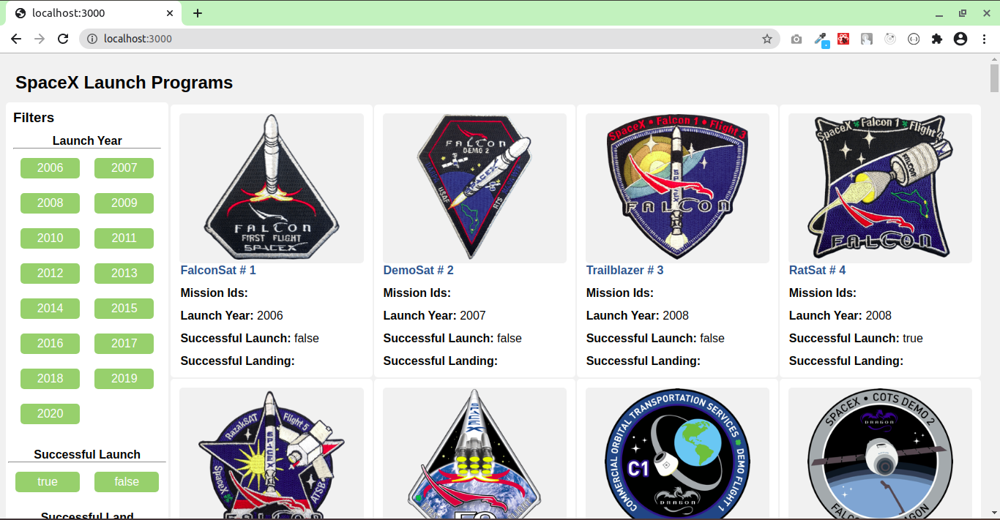
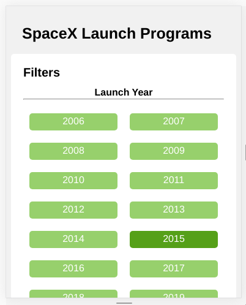
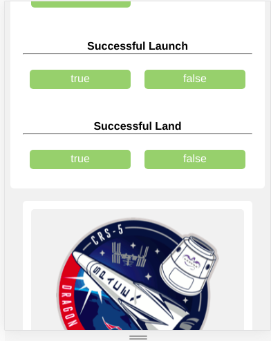
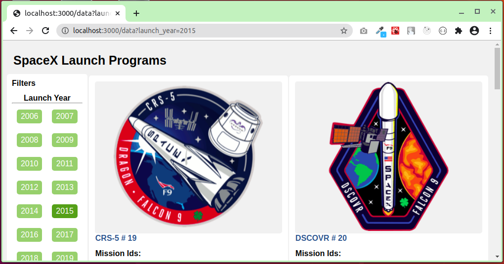
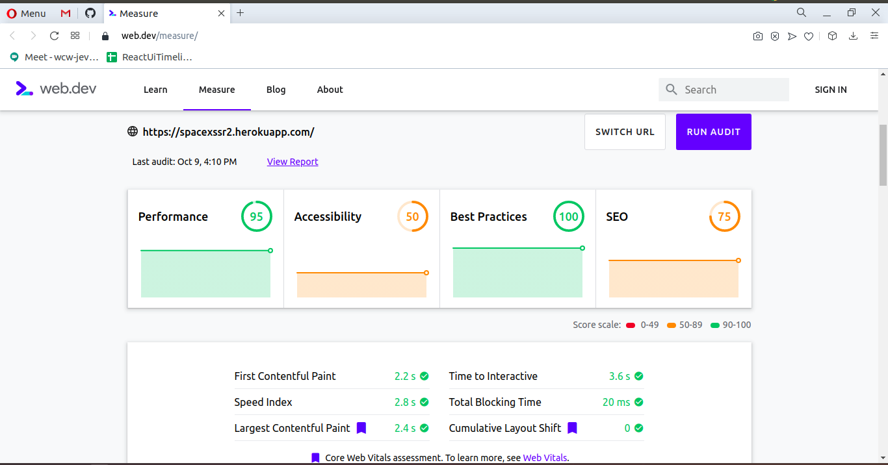

# space_x_ssr

## Installation
$ npm install

#### Run Development ENV
$ npm run dev

#### Create Build
$ npm run build

#### Run Production ENV
$ npm start

### Server side render (Full Screen View)

### Mobile View

### Tablet View

## Score

## Demo Url
https://spacexssr2.herokuapp.com/